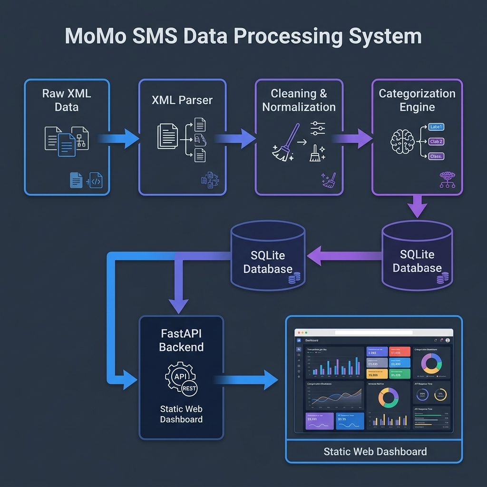

# MoMo SMS Data Processing and Analytics Dashboard

## 1. Project Overview

This project is an enterprise-level full-stack application designed to process and analyze Mobile Money (MoMo) SMS transaction data provided in XML format.

The system will extract transaction information from raw XML data, clean and normalize the data, categorize transactions, store the processed information in a relational database, and provide a web-based dashboard for analyzing and visualizing the transaction data.

The project demonstrates collaborative software development, backend data processing, database management, frontend development, and Agile practices.

## 2. Team


### Team Members

| Member           | Role                           | Main Responsibilities                                                             |
| ---------------- | ------------------------------ | --------------------------------------------------------------------------------- |
| **Aimable**      | Team Lead / Frontend Developer | Project coordination, GitHub management, frontend dashboard, and project planning |
| **Richard**      | Backend / ETL Developer        | XML parsing, data cleaning, normalization, and transaction categorization         |
| **Jean de Dieu** | Architecture / QA              | System architecture, testing, documentation, and risk management                  |
| **Eloi**         | Database Developer             | Database design, SQLite implementation, relationships, and data loading           |

## 3. Project Objectives

The main objectives of this project are to:

* Process MoMo SMS data provided in XML format.
* Extract relevant transaction information from XML files.
* Clean and normalize transaction data.
* Categorize transactions using defined rules.
* Store transaction data in a relational database.
* Generate processed data for analytics.
* Develop a frontend dashboard for data visualization.
* Apply collaborative Git and GitHub development practices.
* Use Agile/Scrum practices to organize and manage development tasks.
* Apply software testing and quality assurance practices.

## 4. Project Scope

The project will cover the following major components:

### Data Processing

* XML file parsing
* Data extraction
* Data cleaning
* Data normalization
* Phone number normalization
* Amount normalization
* Date normalization
* Transaction categorization

### Database

* Relational database design
* SQLite database implementation
* Tables and relationships
* Primary and foreign keys
* Data loading and updating

### Frontend

* Web-based dashboard
* Transaction tables
* Analytics
* Charts and visualizations
* Transaction filtering
* Summary statistics

### Optional API

A FastAPI backend may be implemented to expose transaction and analytics data through API endpoints.

## 5. Technology Stack

The initial technology stack includes:

* **Python** — Data processing and ETL
* **SQLite** — Relational database
* **HTML5** — Frontend structure
* **CSS3** — Frontend styling
* **JavaScript** — Frontend functionality and visualization
* **FastAPI** — Optional backend API
* **Git** — Version control
* **GitHub** — Collaboration and source-code management
* **GitHub Projects** — Scrum board and task management
* **Draw.io / diagrams.net** — System architecture
* **pytest** — Testing

## 6. Project Structure

The project will follow an organized structure based on the requirements of the assignment.

```text
.
├── README.md
├── .env.example
├── requirements.txt
├── index.html
│
├── web/
│   ├── styles.css
│   ├── chart_handler.js
│   └── assets/
│
├── data/
│   ├── raw/
│   │   └── momo.xml
│   ├── processed/
│   │   └── dashboard.json
│   ├── db.sqlite3
│   └── logs/
│       ├── etl.log
│       └── dead_letter/
│
├── etl/
│   ├── __init__.py
│   ├── config.py
│   ├── parse_xml.py
│   ├── clean_normalize.py
│   ├── categorize.py
│   ├── load_db.py
│   └── run.py
│
├── api/
│   ├── __init__.py
│   ├── app.py
│   ├── db.py
│   └── schemas.py
│
├── scripts/
│   ├── run_etl.sh
│   ├── export_json.sh
│   └── serve_frontend.sh
│
├── tests/
│   ├── test_parse_xml.py
│   ├── test_clean_normalize.py
│   └── test_categorize.py
│
└── docs/
    └── system-architecture.png
```

## 7. Team Responsibilities and Tasks

### Aimable — Team Lead / Frontend Developer

Aimable is responsible for coordinating the team and leading the frontend development.

#### Assigned Tasks

* Set up GitHub repository and team collaboration
* Create and maintain the project README
* Plan the frontend dashboard
* Establish the Git workflow
* Coordinate team activities
* Monitor progress on the Scrum board
* Contribute to frontend implementation
* Integrate frontend components with processed data or API

### Richard — Backend / ETL Developer

Richard is responsible for the data processing pipeline and ETL-related activities.

#### Assigned Tasks

* Research MoMo SMS XML structure
* Define transaction categories
* Design the ETL workflow
* Develop XML parsing functionality
* Clean and normalize transaction data
* Categorize transactions
* Contribute to ETL testing
* Ensure processed data is suitable for database storage and analytics

### Jean de Dieu — Architecture / QA

Jean de Dieu is responsible for system architecture, quality assurance, testing, and supporting project documentation.

#### Assigned Tasks

* Create the high-level system architecture diagram
* Set up the project directory structure
* Develop the testing strategy
* Research and document project risks
* Review project organization
* Support documentation
* Verify that system components work together correctly
* Support quality assurance throughout development

### Eloi — Database Developer

Eloi is responsible for the database component of the project.

#### Assigned Tasks

* Plan the database structure
* Identify database entities and attributes
* Define relationships between entities
* Identify primary and foreign keys
* Research SQLite implementation
* Design the database schema
* Implement database tables
* Support data loading and updating
* Validate stored transaction data
* Prepare the database for analytics

## 8. Scrum Board

The team will use **GitHub Projects** to manage the project using an Agile Scrum workflow.

The Scrum board contains the following columns:

* **To Do**
* **In Progress**
* **Done**

### Scrum Board

[View Scrum Board](https://github.com/users/BANCUNGUYE66/projects/1)

Tasks will initially be placed in **To Do**. When a team member starts working on a task, the task will move to **In Progress**. Once the task has been completed and reviewed, it will move to **Done**.

## 9. Initial Project Tasks

The team has created the following initial GitHub Issues:

| #  | Task                                            | Assigned To  |
| -- | ----------------------------------------------- | ------------ |
| 1  | Set up GitHub repository and team collaboration | Aimable      |
| 2  | Create project README                           | Aimable      |
| 3  | Set up project directory structure              | Jean de Dieu |
| 4  | Create system architecture diagram              | Jean de Dieu |
| 5  | Research MoMo SMS XML structure                 | Richard      |
| 6  | Define transaction categories                   | Richard      |
| 7  | Design ETL workflow                             | Richard      |
| 8  | Plan database structure                         | Eloi         |
| 9  | Plan frontend dashboard                         | Aimable      |
| 10 | Define project technology stack                 | Eloi         |
| 11 | Establish Git workflow                          | Aimable      |
| 12 | Set up testing strategy                         | Jean de Dieu |
| 13 | Research and document project risks             | Jean de Dieu |

## 10. Development Workflow

The team will use Git and GitHub for collaborative development.

The general workflow will be:


The team will use meaningful commit messages and feature branches to reduce conflicts and maintain a clean project history.

## 11. System Architecture

The proposed system processes MoMo SMS data through several stages:



```text
MoMo SMS XML
     │
     ▼
XML Parser
     │
     ▼
Data Cleaning & Normalization
     │
     ▼
Transaction Categorization
     │
     ▼
SQLite Database
     │
     ├──────────────► Analytics / Aggregation
     │
     ▼
Optional FastAPI
     │
     ▼
Frontend Dashboard
     │
     ▼
Charts, Tables & Insights
```

## 12. Agile / Scrum Approach

The team will follow an Agile approach to development.

Work will be organized into small tasks represented by GitHub Issues. Each task will have an assigned team member and will move through the Scrum board as work progresses.

### Workflow

**To Do → In Progress → Done**

Team members will regularly communicate about their progress, challenges, and completed tasks.

## 13. Risk Management

The team has identified several potential project risks:

| Risk                                 | Possible Impact                | Mitigation                                        |
| ------------------------------------ | ------------------------------ | ------------------------------------------------- |
| Invalid XML data                     | Parsing errors                 | Validate XML and handle parsing exceptions        |
| Inconsistent transaction formats     | Incorrect data                 | Implement cleaning and normalization rules        |
| Database errors                      | Data loss or incorrect records | Use constraints and testing                       |
| Git merge conflicts                  | Development delays             | Use feature branches and pull requests            |
| Uneven workload                      | Delayed tasks                  | Assign and monitor Issues through the Scrum board |
| Incorrect transaction categorization | Inaccurate analytics           | Define and test categorization rules              |
| Missing or invalid fields            | Incomplete records             | Validate required fields during ETL               |

## 14. Expected Outcome

At the end of the project, the team expects to have an enterprise-level full-stack application capable of:

1. Reading MoMo SMS XML data.
2. Extracting transaction information.
3. Cleaning and normalizing the data.
4. Categorizing transactions.
5. Storing transactions in a relational database.
6. Processing data for analytics.
7. Displaying transaction information through a web dashboard.
8. Providing useful charts, tables, and transaction insights.
9. Demonstrating collaborative Agile development using GitHub.

## 15. Project Resources

### GitHub Repository

[View GitHub Repository](https://github.com/BANCUNGUYE66/process_momo_sms)

### Scrum Board

[View Scrum Board](https://github.com/users/BANCUNGUYE66/projects/1)


## 16. Team Collaboration

All team members are added as collaborators to the GitHub repository. Tasks are distributed through GitHub Issues and managed through the Scrum board.

The team will collaborate through GitHub using Issues, branches, pull requests, code reviews, and the Scrum board to track project progress.
