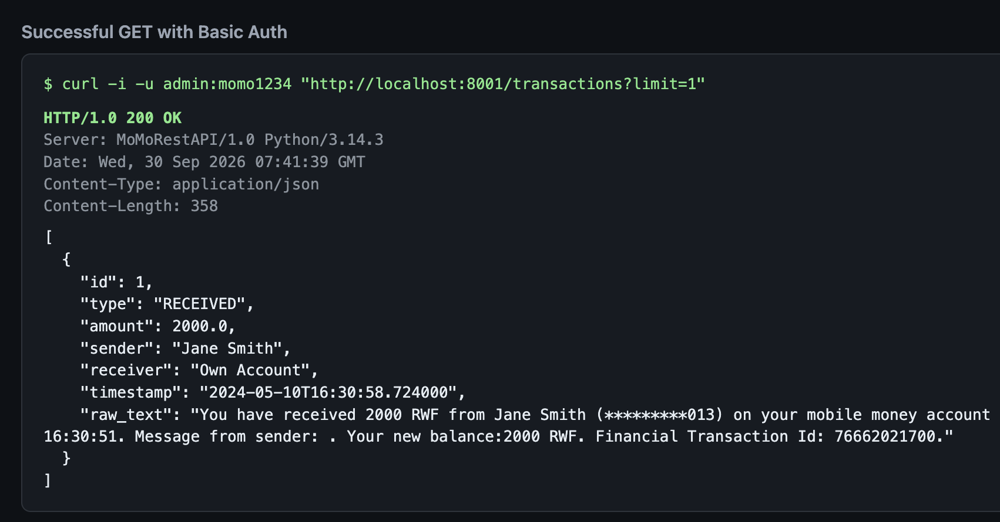
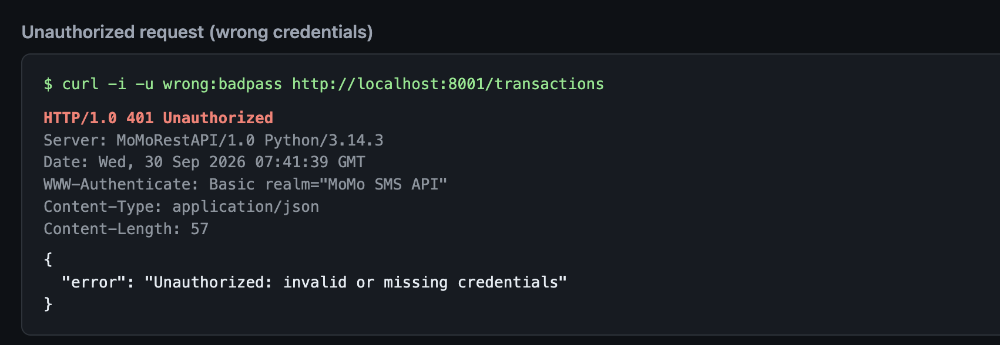
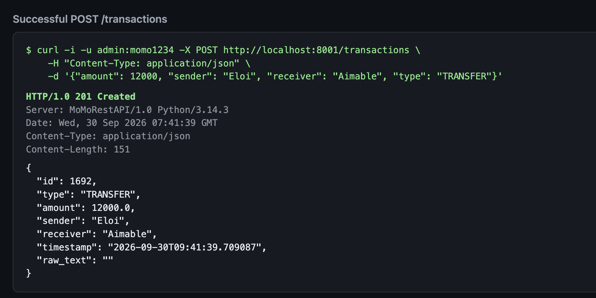
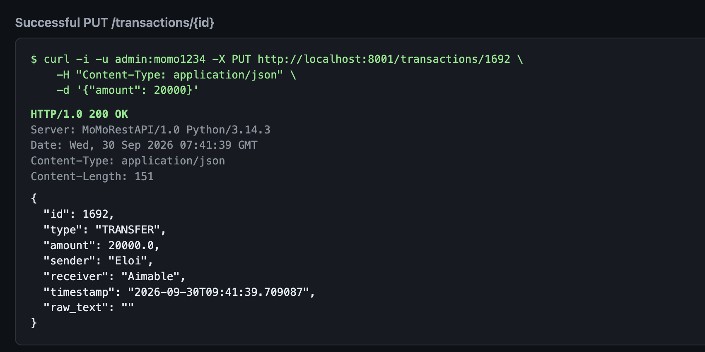
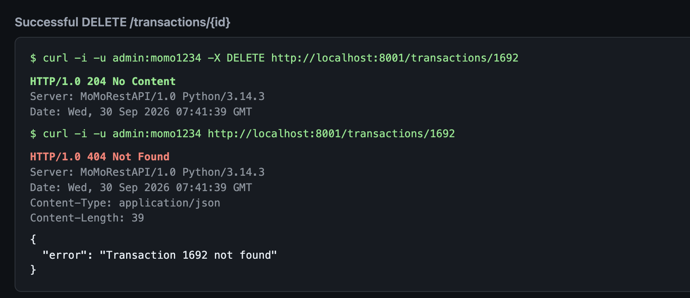

# MoMo SMS Processing System — REST API Testing & Validation

**Course**: Enterprise Software Development  
**Project**: MoMo SMS Data Processing & Analytics System  
**Author**: Eloi (Testing & Validation)  
**Team**: Aimable (Lead), Richard, Jean de Dieu Tuyishime, Eloi  
**Date**: 30 September 2026  
**Component under test**: Plain-Python REST API with HTTP Basic Auth (`api/rest_api.py`)

---

## 1. Scope

This report covers the testing and validation assigned for the REST API + Basic Auth part of the project. The API and its documentation were already implemented (`docs/api_docs.md`, `scripts/demo_curl_tests.sh`). Validation checked that:

- an authorized `GET /transactions` returns **200**
- a request with wrong credentials returns **401**
- a full create / update / delete cycle succeeds (`POST` **201**, `PUT` **200**, `DELETE` **204**)
- related error cases from the demo script also match the documented status codes

---

## 2. How the API was run

```bash
python -m api.rest_api
```

The server listened on `http://localhost:8001` and loaded transactions from `data/raw/modified_sms_v2.xml`. Demo credentials are `admin` / `momo1234`, as documented in `docs/api_docs.md`.

The scripted check was:

```bash
bash scripts/demo_curl_tests.sh http://localhost:8001
```

Automated tests:

```bash
.venv/bin/python -m pytest tests/test_rest_api.py -q
```

Result: **5 passed**.

---

## 3. Results

Every case in `scripts/demo_curl_tests.sh` returned the expected status code.

| # | Check | Expected | Actual |
| - | ----- | -------- | ------ |
| 1 | `GET /transactions` with no credentials | 401 | 401 |
| 2 | `GET /transactions` with wrong credentials | 401 | 401 |
| 3 | `GET /transactions` with valid Basic Auth | 200 | 200 |
| 4 | `GET /transactions/1` | 200 | 200 |
| 5 | `POST /transactions` with a valid body | 201 | 201 |
| 6 | `POST /transactions` missing a required field | 400 | 400 |
| 7 | `PUT /transactions/{id}` updating `amount` | 200 | 200 |
| 8 | `PUT /transactions/999999` (id does not exist) | 404 | 404 |
| 9 | `DELETE /transactions/{id}` | 204 | 204 |
| 10 | `GET /transactions/{id}` after delete | 404 | 404 |
| 11 | `DELETE /transactions/999999` | 404 | 404 |

The unauthorized response includes `WWW-Authenticate: Basic realm="MoMo SMS API"` and the body `{"error": "Unauthorized: invalid or missing credentials"}`.

The CRUD cycle created transaction `1692` (`TRANSFER`, amount `12000`, sender `Eloi`, receiver `Aimable`), updated the amount to `20000`, then deleted it. A follow-up GET returned **404**, so the record was gone.

Raw `curl -i` transcripts are saved in `docs/evidence/`. The full demo-script log is `docs/evidence/06_demo_curl_tests.txt`. In the screenshots below, JSON bodies are pretty-printed so they are readable. The `Content-Length` header is the size of the original compact body, which is what `docs/evidence/` stores verbatim.

---

## 4. Curl evidence

### 4.1 Successful GET with Basic Auth

`GET /transactions?limit=1` with `admin` / `momo1234` returned **200 OK** and the first stored transaction.



### 4.2 Unauthorized request (wrong credentials)

`GET /transactions` with username `wrong` and password `badpass` returned **401 Unauthorized**.



### 4.3 Successful POST

`POST /transactions` created transaction `1692` and returned **201 Created**.



### 4.4 Successful PUT

`PUT /transactions/1692` changed the amount from `12000` to `20000` and returned **200 OK**.



### 4.5 Successful DELETE

`DELETE /transactions/1692` returned **204 No Content**. The next GET for that id returned **404 Not Found**.



---

## 5. Automated tests

`tests/test_rest_api.py` was run against a temporary server started by pytest (not port 8001). All five tests passed:

- `test_unauthorized_without_credentials`
- `test_unauthorized_with_wrong_credentials`
- `test_list_transactions_authorized`
- `test_full_crud_cycle`
- `test_get_nonexistent_returns_404`

---

## 6. Conclusion

The REST API behaves as documented in `docs/api_docs.md`. Basic Auth rejects missing and wrong credentials with **401**. Authorized clients can list, create, update, and delete transactions, and the error codes for a bad body (`400`) and a missing id (`404`) match the demo script.

### Note for the team participation sheet

**Eloi — Testing & Validation.** Ran the REST API locally, executed `scripts/demo_curl_tests.sh` (11/11 checks passed), ran `tests/test_rest_api.py` (5 passed), and recorded curl evidence for authorized GET, unauthorized access, and successful POST, PUT, and DELETE. Write-up: `docs/api_testing_validation.md`. Screenshots: `screenshots/api_*.png`.
