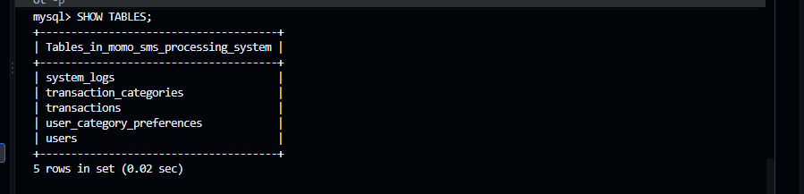
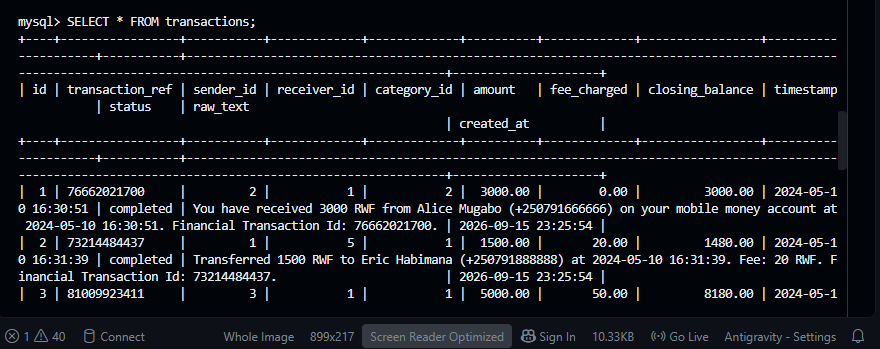
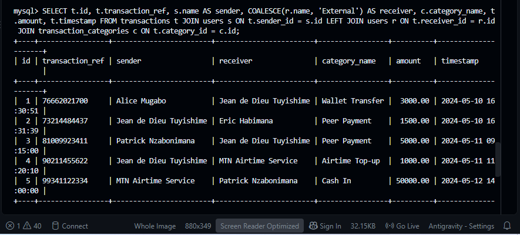
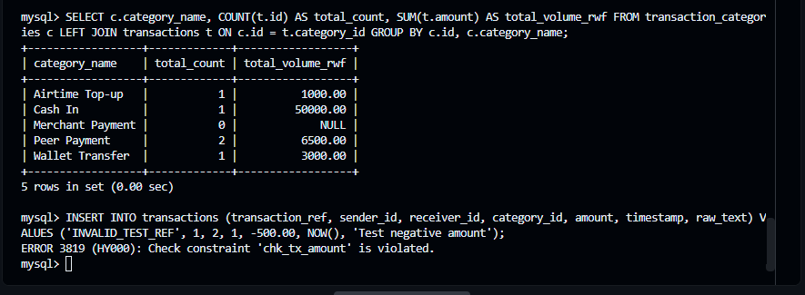

# MoMo SMS Processing System — Database Design Document

**Course**: Enterprise Software Development  
**Project**: MoMo SMS Data Processing & Analytics System  
**Author**: Jean de Dieu Tuyishime (Architecture / QA)  
**Team**: Aimable (Lead), Richard, Jean de Dieu Tuyishime, Eloi  

---

## 1. Data Dictionary

### 1.1 Table: `users`
Stores registered Mobile Money account holders, customers, merchants, and agents.

| Column Name | Data Type | Key / Constraint | Description |
| :--- | :--- | :--- | :--- |
| `id` | `INT AUTO_INCREMENT` | `PRIMARY KEY` | Unique identifier for each user |
| `phone_number` | `VARCHAR(20)` | `NOT NULL, UNIQUE` | Normalized mobile phone number (`+250...`) |
| `name` | `VARCHAR(100)` | `NOT NULL` | Display name of the account holder |
| `user_type` | `ENUM('personal', 'merchant', 'agent')` | `DEFAULT 'personal'` | Role classification of wallet holder |
| `wallet_balance` | `DECIMAL(15,2)` | `CHECK (wallet_balance >= 0.00)` | Current wallet balance in RWF |
| `created_at` | `DATETIME` | `DEFAULT CURRENT_TIMESTAMP` | Registration timestamp |

---

### 1.2 Table: `transaction_categories`
Defines transaction types and keyword classification rules.

| Column Name | Data Type | Key / Constraint | Description |
| :--- | :--- | :--- | :--- |
| `id` | `INT AUTO_INCREMENT` | `PRIMARY KEY` | Unique category identifier |
| `category_name` | `VARCHAR(50)` | `NOT NULL, UNIQUE` | Name of category (e.g., Peer Payment) |
| `tx_type` | `ENUM('payment', 'transfer', 'deposit', 'airtime')` | `NOT NULL` | High-level transaction classification |
| `description` | `TEXT` | Optional | Detailed category description |
| `created_at` | `DATETIME` | `DEFAULT CURRENT_TIMESTAMP` | Creation timestamp |

---

### 1.3 Table: `user_category_preferences` (Junction Table for M:N)
Resolves Many-to-Many (M:N) relationship between Users and Transaction Categories.

| Column Name | Data Type | Key / Constraint | Description |
| :--- | :--- | :--- | :--- |
| `user_id` | `INT` | `PK, FK (users.id)` | Foreign key referencing `users.id` |
| `category_id` | `INT` | `PK, FK (transaction_categories.id)` | Foreign key referencing `transaction_categories.id` |
| `notification_enabled` | `BOOLEAN` | `DEFAULT TRUE` | Category notification alert preference |
| `created_at` | `DATETIME` | `DEFAULT CURRENT_TIMESTAMP` | Setting creation timestamp |

---

### 1.4 Table: `transactions`
Central transaction table storing cleaned MoMo SMS records.

| Column Name | Data Type | Key / Constraint | Description |
| :--- | :--- | :--- | :--- |
| `id` | `INT AUTO_INCREMENT` | `PRIMARY KEY` | Unique transaction identifier |
| `transaction_ref` | `VARCHAR(50)` | `NOT NULL, UNIQUE` | Reference code (e.g., `76662021700`) |
| `sender_id` | `INT` | `FK (users.id)` | Foreign key referencing sender |
| `receiver_id` | `INT` | `FK (users.id), NULLABLE` | Foreign key referencing receiver |
| `category_id` | `INT` | `FK (transaction_categories.id)` | Foreign key referencing category |
| `amount` | `DECIMAL(12,2)` | `CHECK (amount > 0.00)` | Monetary value in RWF |
| `fee_charged` | `DECIMAL(10,2)` | `CHECK (fee_charged >= 0.00)` | Service fee charged |
| `closing_balance` | `DECIMAL(15,2)` | Optional | Wallet balance after transaction |
| `timestamp` | `DATETIME` | `NOT NULL` | Date and time transaction took place |
| `status` | `ENUM('completed', 'failed', 'pending')` | `DEFAULT 'completed'` | Execution status |
| `raw_text` | `TEXT` | `NOT NULL` | Original SMS message body |
| `created_at` | `DATETIME` | `DEFAULT CURRENT_TIMESTAMP` | System ingestion timestamp |

---

### 1.5 Table: `system_logs`
Audit log tracking pipeline operational events and diagnostic errors.

| Column Name | Data Type | Key / Constraint | Description |
| :--- | :--- | :--- | :--- |
| `id` | `INT AUTO_INCREMENT` | `PRIMARY KEY` | Unique log entry identifier |
| `log_level` | `ENUM('INFO', 'WARNING', 'ERROR')` | `NOT NULL` | Severity level of log |
| `module_name` | `VARCHAR(50)` | `NOT NULL` | Ingestion component module |
| `message` | `TEXT` | `NOT NULL` | Diagnostic log string |
| `timestamp` | `DATETIME` | `DEFAULT CURRENT_TIMESTAMP` | Event timestamp |

---

## 2. Database Security & Data Integrity Rules

1. **Referential Integrity Constraints**:
   - `CONSTRAINT fk_tx_sender FOREIGN KEY (sender_id) REFERENCES users(id) ON DELETE RESTRICT`: Blocks user deletion if linked to transaction records.
   - `CONSTRAINT fk_tx_receiver FOREIGN KEY (receiver_id) REFERENCES users(id) ON DELETE SET NULL`: Sets receiver foreign key to NULL upon account removal.
   - `CONSTRAINT fk_tx_category FOREIGN KEY (category_id) REFERENCES transaction_categories(id) ON DELETE RESTRICT`: Prevents deletion of active categories.

2. **Domain Validation Constraints (`CHECK`)**:
   - `CONSTRAINT chk_tx_amount CHECK (amount > 0.00)`: Restricts zero or negative transaction values.
   - `CONSTRAINT chk_fee_charged CHECK (fee_charged >= 0.00)`: Enforces non-negative transaction fees.
   - `CONSTRAINT chk_wallet_balance CHECK (wallet_balance >= 0.00)`: Prevents negative account balances.

3. **Uniqueness Constraints**:
   - `transaction_ref` (`VARCHAR(50) UNIQUE`): Prevents duplicate transaction ingestion.
   - `phone_number` (`VARCHAR(20) UNIQUE`): Enforces distinct mobile user identities.

---

## 3. Sample Queries & Verification Screenshots

### 3.1 Table Schema Navigator
  
*(Refer to screenshots/ directory for execution screenshot: `screenshots/Tables.png`)*

```sql
USE momo_sms_processing_system;
SHOW TABLES;
```

---

### 3.2 Transaction Records (`SELECT * FROM transactions;`)
  
*(Refer to screenshots/ directory for execution screenshot: `screenshots/Transactions.png`)*

```sql
SELECT * FROM transactions;
```

---

### 3.3 Relational JOIN Query Result
  
*(Refer to screenshots/ directory for execution screenshot: `screenshots/join.png`)*

```sql
SELECT 
    t.id AS tx_id,
    t.transaction_ref,
    s.name AS sender_name,
    s.phone_number AS sender_phone,
    COALESCE(r.name, 'External/Service') AS receiver_name,
    c.category_name,
    t.amount,
    t.fee_charged,
    t.timestamp
FROM transactions t
JOIN users s ON t.sender_id = s.id
LEFT JOIN users r ON t.receiver_id = r.id
JOIN transaction_categories c ON t.category_id = c.id
ORDER BY t.timestamp DESC;
```

---

### 3.4 GROUP BY Category Aggregation Summary
  
*(Refer to screenshots/ directory for execution screenshot: `screenshots/Aggregations.png`)*

```sql
SELECT 
    c.category_name,
    COUNT(t.id) AS total_count,
    SUM(t.amount) AS total_volume_rwf
FROM transaction_categories c
LEFT JOIN transactions t ON c.id = t.category_id
GROUP BY c.id, c.category_name;
```

---

### 3.5 Database & JSON Schema Validation Test Results
  
*(Refer to screenshots/ directory for execution screenshot: `screenshots/database verification.png`)*

  
*(Refer to screenshots/ directory for execution screenshot: `screenshots/json valid.png`)*

---

## 4. AI Usage & Transparency Log

| Date | Contributor | Permitted Purpose | Query / Input Description | Output / Action Taken |
| :--- | :--- | :--- | :--- | :--- |
| **2026-09-14** | Jean de Dieu | Syntax & Format Checking | Checking PlantUML ERD diagram syntax formatting | Corrected `@startuml` block structure to resolve PlantUML renderer syntax warning |
| **2026-09-15** | Jean de Dieu | Documentation Grammar & Syntax | Reviewing 250–300 word ERD design rationale text for grammatical clarity | Polished technical explanation phrasing and verified word count (257 words) |
| **2026-09-15** | Jean de Dieu | MySQL Best Practices Verification | Researching MySQL 8.0 `COMMENT` syntax and `CHECK` constraint syntax | Confirmed `ENGINE=InnoDB` and `CONSTRAINT chk_... CHECK (...)` syntax compliance |
| **2026-09-15** | Jean de Dieu | Git Command Syntax Verification | Checking Git command syntax for local exclude (`.git/info/exclude`) and branch management | Applied `.git/info/exclude` configuration for local file exclusion |
