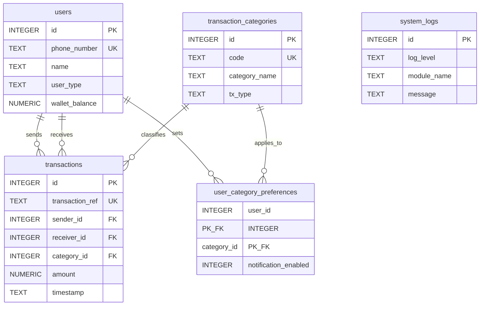

# MoMo SMS Processing System — SQLite Database Design

**Course**: Enterprise Software Development  
**Project**: MoMo SMS Data Processing & Analytics System  
**Author**: Eloi (Database Developer)  
**Assignment 2 update**: database design, entities, relationships, and schema  
**Engine**: SQLite 3 (`data/db.sqlite3`)

---

## Team update

The SQLite database is planned and implemented as a normalized relational store for cleaned MoMo SMS records.

- **Entities**: `users`, `transaction_categories`, `user_category_preferences`, `transactions`, `system_logs`
- **Relationships**: a user sends or receives many transactions (1:N); a category classifies many transactions (1:N); users and categories are linked M:N through `user_category_preferences`
- **Schema files**: `database/schema.sql` (DDL + default categories + analytics view) and `database/seed.sql` (sample rows)
- **Runtime**: `etl/load_db.py` creates the file-based SQLite database, upserts users/categories, and loads ETL output with foreign keys enabled

Initialize locally with:

```bash
python scripts/init_db.py --seed
```

---

## 1. SQLite planning

SQLite is the project database because the README technology stack and ETL path already target a local file (`data/db.sqlite3`). It is serverless, ACID-compliant, and needs no separate database process, which fits a team assignment and the FastAPI dashboard.

| Planning decision | SQLite approach |
| :--- | :--- |
| Database location | Single file `data/db.sqlite3` |
| Identity columns | `INTEGER PRIMARY KEY AUTOINCREMENT` |
| Enumerations | `TEXT` plus `CHECK (col IN (...))` |
| Money (RWF) | `NUMERIC` so decimals are not stored as binary floats only |
| Dates | ISO-8601 `TEXT` (`YYYY-MM-DD HH:MM:SS`) |
| Booleans | `INTEGER` 0/1 with a CHECK constraint |
| Referential integrity | `PRAGMA foreign_keys = ON` on every connection |
| Concurrent ETL + API | `PRAGMA journal_mode = WAL` |
| Analytics access | View `v_transaction_details` flattens joins for the API |

SQLite does not support `ENUM`, `COMMENT` on columns, or `ENGINE=InnoDB`. Those MySQL features are represented here with CHECK constraints, SQL `--` documentation, and WAL instead of InnoDB.

---

## 2. Entities and attributes

The model is in third normal form. Transaction type names live in `transaction_categories`, not repeated on every SMS row. Phone numbers live in `users` and are referenced by foreign keys.

### 2.1 `users`

Registered or inferred Mobile Money parties (personal wallets, merchants, agents, and system/service numbers).

| Column | Type | Constraints | Description |
| :--- | :--- | :--- | :--- |
| `id` | `INTEGER` | `PRIMARY KEY AUTOINCREMENT` | Surrogate key |
| `phone_number` | `TEXT` | `NOT NULL UNIQUE` | Normalized `+250...` number |
| `name` | `TEXT` | `NOT NULL` | Display name; phone is used if SMS has no name |
| `user_type` | `TEXT` | `CHECK IN ('personal','merchant','agent','system')` | Role of the wallet holder |
| `wallet_balance` | `NUMERIC` | `>= 0` | Last known balance in RWF |
| `created_at` | `TEXT` | `DEFAULT datetime('now')` | Row creation time |

### 2.2 `transaction_categories`

Lookup table aligned with `etl/config.py` category codes.

| Column | Type | Constraints | Description |
| :--- | :--- | :--- | :--- |
| `id` | `INTEGER` | `PRIMARY KEY AUTOINCREMENT` | Surrogate key |
| `code` | `TEXT` | `NOT NULL UNIQUE` | ETL code (`TRANSFER`, `RECEIVE`, `PAYMENT`, `CASH_OUT`, `AIRTIME`, `OTHER`) |
| `category_name` | `TEXT` | `NOT NULL UNIQUE` | Human-readable label for the dashboard |
| `tx_type` | `TEXT` | `CHECK IN ('payment','transfer','deposit','withdrawal','airtime','other')` | High-level financial type |
| `description` | `TEXT` | Optional | Rule description |
| `created_at` | `TEXT` | Default now | Creation time |

### 2.3 `user_category_preferences` (junction)

Resolves the many-to-many link between users and categories (notification preferences).

| Column | Type | Constraints | Description |
| :--- | :--- | :--- | :--- |
| `user_id` | `INTEGER` | `PK, FK → users.id` | User who owns the preference |
| `category_id` | `INTEGER` | `PK, FK → transaction_categories.id` | Category the preference applies to |
| `notification_enabled` | `INTEGER` | `0` or `1` | Whether alerts are enabled |
| `created_at` | `TEXT` | Default now | Setting timestamp |

### 2.4 `transactions`

Central fact table for cleaned SMS records.

| Column | Type | Constraints | Description |
| :--- | :--- | :--- | :--- |
| `id` | `INTEGER` | `PRIMARY KEY AUTOINCREMENT` | Surrogate key |
| `transaction_ref` | `TEXT` | `UNIQUE`, nullable | MoMo financial transaction id when present |
| `sender_id` | `INTEGER` | `NOT NULL, FK → users.id` | Party the SMS is attributed to |
| `receiver_id` | `INTEGER` | `FK → users.id`, nullable | Counterparty when known |
| `category_id` | `INTEGER` | `NOT NULL, FK → transaction_categories.id` | Classification from ETL |
| `amount` | `NUMERIC` | `CHECK (amount > 0)` | Value in RWF |
| `fee_charged` | `NUMERIC` | `>= 0` | Fee in RWF |
| `closing_balance` | `NUMERIC` | `NULL` or `>= 0` | Wallet balance after the SMS |
| `timestamp` | `TEXT` | `NOT NULL` | Transaction time |
| `status` | `TEXT` | `completed / failed / pending` | Processing status |
| `raw_text` | `TEXT` | `NOT NULL` | Original SMS body |
| `created_at` | `TEXT` | Default now | Ingestion time |

A unique index on `(timestamp, raw_text)` blocks duplicate SMS ingest when no financial reference exists.

### 2.5 `system_logs`

Standalone operational log. It has no foreign keys so parser/load failures can still be recorded.

| Column | Type | Constraints | Description |
| :--- | :--- | :--- | :--- |
| `id` | `INTEGER` | `PRIMARY KEY AUTOINCREMENT` | Surrogate key |
| `log_level` | `TEXT` | `INFO / WARNING / ERROR` | Severity |
| `module_name` | `TEXT` | `NOT NULL` | ETL module (`parse_xml`, `load_db`, ...) |
| `message` | `TEXT` | `NOT NULL` | Diagnostic text |
| `timestamp` | `TEXT` | Default now | Event time |

---

## 3. Relationships

```text
users 1 ────────────< transactions          (sender_id)     identifying 1:N
users 1 ────────────< transactions          (receiver_id)   optional 1:N
transaction_categories 1 ──< transactions   (category_id)   identifying 1:N
users M ────────────< user_category_preferences >──────── N transaction_categories
system_logs                                 isolated audit table
```

| Relationship | Cardinality | Foreign key | Delete rule | Reason |
| :--- | :--- | :--- | :--- | :--- |
| User sends transaction | 1:N | `transactions.sender_id` | `RESTRICT` | Do not delete a user who still has sent SMS history |
| User receives transaction | 1:N (optional) | `transactions.receiver_id` | `SET NULL` | Airtime/system SMS may have no counterparty; user removal should not drop history |
| Category classifies transaction | 1:N | `transactions.category_id` | `RESTRICT` | Categories in use cannot be deleted |
| User prefers category | M:N | composite PK in `user_category_preferences` | `CASCADE` | Preferences disappear with the user or category |

PlantUML source: `docs/erd_sqlite.puml`.



---

## 4. Integrity, keys, and indexes

**Primary keys**: surrogate `id` on every strong entity; composite `(user_id, category_id)` on the junction table.

**Unique keys**: `users.phone_number`, `transaction_categories.code`, `transaction_categories.category_name`, `transactions.transaction_ref`, `(transactions.timestamp, raw_text)`.

**CHECK constraints**: non-negative balances and fees, strictly positive amounts, closed sets for `user_type`, `tx_type`, `status`, and `log_level`.

**Indexes**: foreign keys (`sender_id`, `receiver_id`, `category_id`) and analytics filters (`timestamp`, `status`, `code`) so dashboard aggregations do not scan the full fact table.

---

## 5. ETL loading strategy

`etl/load_db.py` is the SQLite implementation of the Load step:

1. Open `data/db.sqlite3` with `PRAGMA foreign_keys = ON`.
2. Apply `database/schema.sql` (idempotent `CREATE IF NOT EXISTS` + default categories).
3. For each cleaned SMS: get-or-create the sender in `users`, resolve `category_id` from the ETL `code`, insert into `transactions`.
4. Skip rows with missing or non-positive `amount` and write an `ERROR` row to `system_logs`.
5. Ignore duplicate `(timestamp, raw_text)` or `transaction_ref` on re-runs.

This keeps Richard’s ETL output (`sender`, `timestamp`, `amount`, `category`, `raw_text`) mapped onto the relational schema without denormalizing category names onto the fact table.

---

## 6. Sample analytics queries

Join senders, receivers, and categories:

```sql
SELECT
    t.transaction_ref,
    s.name AS sender_name,
    COALESCE(r.name, 'External/Service') AS receiver_name,
    c.category_name,
    t.amount,
    t.timestamp
FROM transactions t
JOIN users s ON t.sender_id = s.id
LEFT JOIN users r ON t.receiver_id = r.id
JOIN transaction_categories c ON t.category_id = c.id
ORDER BY t.timestamp DESC;
```

Volume by category (dashboard aggregation):

```sql
SELECT
    c.code,
    c.category_name,
    COUNT(t.id) AS total_count,
    COALESCE(SUM(t.amount), 0) AS total_volume_rwf
FROM transaction_categories c
LEFT JOIN transactions t ON t.category_id = c.id
GROUP BY c.id, c.code, c.category_name
ORDER BY total_volume_rwf DESC;
```

The API reads the same join through `v_transaction_details`.

---

## 7. How to verify

```bash
python scripts/init_db.py --seed
python -m pytest tests/test_database.py -q
```

Expected result: SQLite file created, five related tables plus one view, sample rows loaded, foreign-key and CHECK constraints enforced.

---

## 8. AI usage (this deliverable)

| Date | Contributor | Permitted purpose | Query / input | Output / action |
| :--- | :--- | :--- | :--- | :--- |
| **2026-09-18** | Eloi | SQLite syntax verification | Confirm `PRAGMA foreign_keys`, `CHECK` replacements for ENUM, and `CREATE VIEW` syntax | Applied verified SQLite DDL in `database/schema.sql` |
| **2026-09-18** | Eloi | Documentation formatting | Structure entity tables and relationship summary for Assignment 2 | Formatted this design document |
